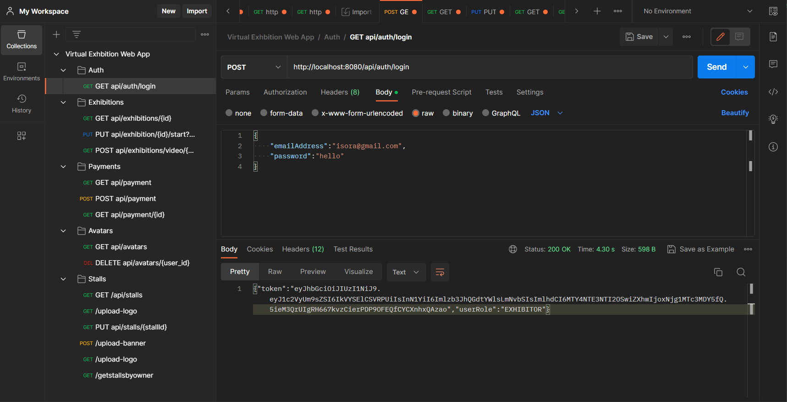

# Introduction
Nerambum is an innovative virtual exhibition platform that recreates a real-life exhibition experience in a digital space.This microservices based web application is primarily designed for managing virtual exhibitions on the Nerambum platform. It provides a suite of tools and features for exhibition owners, exhibitors, and attendees to create and participate in immersive and interactive virtual exhibitions.  

The application has several core functionalities, including the ability to create and manage exhibitions, customize virtual stalls, create and manage attendee avatars, manage tickets and payments, and provide live streaming capabilities. The application also includes a feedback service to collect attendee feedback and a statistics service to track attendance and engagement.  

Exhibition owners can use the web application to create and manage exhibitions, and allocate stalls to exhibitors. Exhibitors, in turn, can use this application to select and purchase their preferred stall tier, customize their virtual stalls with branding and marketing materials, and interact with attendees in real-time through live streaming. Attendees can create and customize their own avatars, and buy tickets with the web application.  

Overall, the web application is an essential tool for managing virtual exhibitions on the Nerambum platform, providing a seamless and immersive experience for all stakeholders involved.

# Architecture
The architecture of the application is depicted in the following figure.

  

**Design decisions taken to split into services**
Services were split depending on the fact that each service should focus on a specific functionality while ensuring a clear separation of concerns.

# Micro-services
**The implementation methods used (Netflix software stack)

## Core services
Our system consists of 9 core services, each with its own database.  
* Auth Service - Manages user accounts, credentials, and access control.  
* Exhibition Service - Allows the creation, management, and hosting of exhibitions.  
* Stall Service - Enables exhibitors to purchase and customize virtual exhibition stalls.   
* Avatar Service - Allows attendeed to create and customize their avatars.  
* Ticket Service - Manages virtual exhibition tickets, including creation, pricing, and allocation.  
* Payment Service - Securely processes payments, integrating with payment gateways to allow attendees to purchase tickets and stall owners to buy stalls.  
* Agora Token Server Service - Generates tokens to authenticate and authorize users for live streaming sessions.  
* Feedback Service - Collects and retrieves user feedback.  
* Stats Service -  Handles attendance statistics, providing exhibition owners with an overview of their exhibition. 

**The REST API exposed by the microservice**
Auth Service
* GET /api/auth/validate/{token}
* GET /api/auth/getAdmin/{emailAddress}
* GET /api/auth/getAttendee/{emailAddress}
* GET /api/auth/getExhibitor/{emailAddress}
* GET /api/auth/getExhibitionOwner/{emailAddress}
* POST /api/auth/adminRegistration
* POST /api/auth/attendeeRegistration
* POST /api/auth/exhibitionOwnerRegistration
* POST /api/auth/exhibitorRegistration
* POST /api/auth/login
* PUT /api/auth/updateAdmin/{prevEmail}
* PUT /api/auth/updateAttendee/{prevEmail}
* PUT /api/auth/updateExhibitor/{prevEmail}
* PUT /api/auth/forgotPassword/{emailAddress}
* PUT /api/auth/confirm/{emailAddress}
* DELETE /api/auth/delete/{emailAddress}

Exhibition Service
* GET /api/exhibitions
* GET /api/exhibitions/{Id}
* GET /api/exhibition/user/{exhibitionOwnerId}
* GET /api/exhibitions/getByExhibitionOwner/{Id} 
* GET /api/exhibitions/exhibition/{exhibitionId}
* POST /api/exhibitions
* POST /api/exhibitions/video/{Id}
* PUT /api/exhibitins/activeUsers/{Id}
* PUT /api/exhibitions/approve/{exhibitionId}
* PUT /api/exhibitions/{Id}/start
* PUT /api/exhibitions/visitedUsers/{Id}
* DELETE /api/exhibitions/{Id}

Stall Service
* GET /api/stalls
* GET /api/stalls/{exhibitionId}/stallOwner
* GET /api/stalls/{exhibitionId}/stallId
* GET /api/stalls/{exhibitionId}/stall
* POST /api/stalls
* POST /api/stalls/upload-logo/{exhibitionId}
* POST /api/stalls/upload-video/{exhibitionId}
* POST /api/stalls/upload-3dmodel/{exhibitionId}
* PUT /api/stalls/update-stall/{exhibitionId}
* DELETE /api/stalls/{stallId}

Avatar Service
* GET /api/avatars
* POST /api/avatars 
* GET /api/avatars/{userId}
* PUT /api/avatars/
* DELETE /api/avatars/{user_id}

Ticket Service
* POST /api/tickets
* GET /api/tickets/{ticketId}
* GET /api/tickets/getTicketInfo/{userId}
* PUT /api/tickets/{ticketId}
* DELETE /api/tickets/{ticketId}

Payment Service
* POST /api/payments
* GET /api/payments
* GET /api/payments/{paymentId}

Agora Token Server Service
* POST /api/agora/liveStreamChannel
* GET /api/agora/{exhibitionId}/{stallId}
* PUT /api/agora/token
* PUT /api/agora/end

Feedback Service
* POST /api/feedbacks
* GET /api/feedbacks
* GET /api/feedbacks/{id}
* GET /api/feedback/exhibition/{id}
* GET /api/feedback/userRole
* GET /api/feedback/type

Stats Service
* POST /api/stats
* GET /api/stats/{id}
* GET /api/stats
* GET /api/stats/exhibition/sum/{exhibitionId}
* GET /api/stats/exhibition/avg/{exhibitionId}
* GET /api/stats/exhibition/max/{exhibitionId}
* GET /api/stats/exhibition/min/{exhibitionId}
 
**Inter-service interactions happened via the micro-service**

* Exhibition service and Auth service to fetch exhibition owner details when fetching an exhibition.
* Payment service and Auth service to fetch paid users' details when fetching one payment detail.
* Ticket service and Auth service to fetch users' details when fetching a ticket.
* Feedback service and Exhibition service to fetch exhibition details when fetching a feedback regarding an exhibition.

## Discovery Server
* Netflix Eureka was used as the discovery server. It basically acts as a centralized registry of all the available services, including their IP addresses, ports and other metadata [1].
* Services can be added or removed dynamically without requiring changes to the configuration of other services.
 The figure illustrates the instances that are registered in the discovery server and are currently up in status. Here each service acts as a discovery client.

  

## API Gateway
* To implement the api gateway Spring Cloud gateway was used. It provides a library for building API gateways on top of Spring and Java [2]. 
* Configured on port 8080.
* Added jwt authentication and token validity time.
* Routes were configured for the services allowing the Spring Cloud Gateway to proxy and forward requests to the appropriate services based on the defined routes.
* A filtering method was implemented from the GatewayFilter interface, to perform the actual filtering logic for incoming requests.
* JWT authentication filter for the API Gateway, ensures that incoming requests to protected API endpoints are authenticated by validating the JWT tokens.

# User Interface
The front-end user interface of the Nerambum web application was developed using React.

https://github.com/hanzjk/Virtual-Exhibition-Web-Application/assets/65526190/74197171-6d7d-46b4-9225-aac376468446

**How you used the API testing tools**

Postman was used to test all the implemented APIs.

  

# Deployment
All the services are deployed in docker using docker-compose. Thus, each service contains a container which pushed to the docker hub.

  

# References
[1] W. by: baeldung, “Introduction to spring cloud netflix - eureka,” Baeldung, https://www.baeldung.com/spring-cloud-netflix-eureka#:~:text=Client%2Dside%20service%20discovery%20allows,each%20service%20has%20to%20register. (accessed May 27, 2023). 
[2] https://tanzu.vmware.com/developer/guides/scg-what-is/#:~:text=Spring%20Cloud%20Gateway%20provides%20a,security%2C%20resiliency%2C%20and%20monitoring. 
