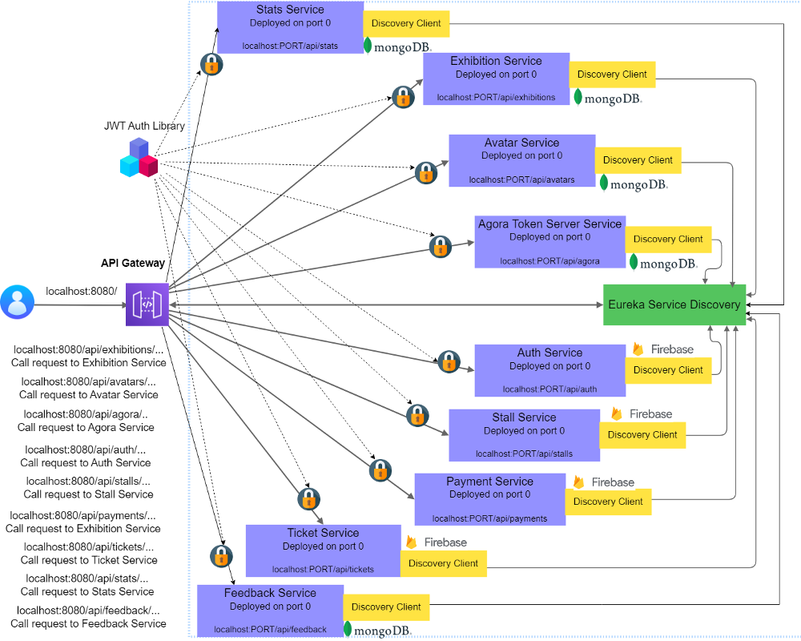

# Introduction
Nerambum is an innovative virtual exhibition platform that recreates a real-life exhibition experience in a digital space.This microservices based web application is primarily designed for managing virtual exhibitions on the Nerambum platform. It provides a suite of tools and features for exhibition owners, exhibitors, and attendees to create and participate in immersive and interactive virtual exhibitions.  

The application has several core functionalities, including the ability to create and manage exhibitions, customize virtual stalls, create and manage attendee avatars, manage tickets and payments, and provide live streaming capabilities. The application also includes a feedback service to collect attendee feedback and a statistics service to track attendance and engagement.  

Exhibition owners can use the web application to create and manage exhibitions, and allocate stalls to exhibitors. Exhibitors, in turn, can use this application to select and purchase their preferred stall tier, customize their virtual stalls with branding and marketing materials, and interact with attendees in real-time through live streaming. Attendees can create and customize their own avatars, and buy tickets with the web application.  

https://github.com/hanzjk/Virtual-Exhibition-Web-Application/assets/65526190/b6211f7f-0fc3-4483-af34-0aab7a6e873c

Overall, the web application is an essential tool for managing virtual exhibitions on the Nerambum platform, providing a seamless and immersive experience for all stakeholders involved.
# Architecture
The architecture of the application is depicted in the following figure.

  

**Design decisions taken to split into services

# Micro-services
**The implementation methods used (Netflix software stack)

## Core services
Our system consists of 9 core services, each with its own database.  
* Auth Service - Manages user accounts, credentials, and access control.  
* Exhibition Service - Allows the creation, management, and hosting of exhibitions.  
* Stall Customization Service - Enables exhibitors to purchase and customize virtual exhibition stalls.   
* Avatar Service - Allows attendeed to create and customize their avatars.  
* Ticket Service - Manages virtual exhibition tickets, including creation, pricing, and allocation.  
* Payment Service - Securely processes payments, integrating with payment gateways to allow attendees to purchase tickets and stall owners to buy stalls.  
* Agora Token Server Service - Generates tokens to authenticate and authorize users for live streaming sessions.  
* Feedback Service - Collects and retrieves user feedback.  
* Stats Service -  Handles attendance statistics, providing exhibition owners with an overview of their exhibition. 

**The REST API exposed by the microservice

**Inter-service interactions happened via the micro-service
## Discovery Server
## API Gateway
Include the configurations in API gateway.

# User Interface
The front-end user interface of the Nerambum web application was developed using React.

<video src='DS-VIDEO1.mp4' ></video>

**How you used the API testing tools

# Deployment
**Suggest a method to deploy the system to use in production.

# References
